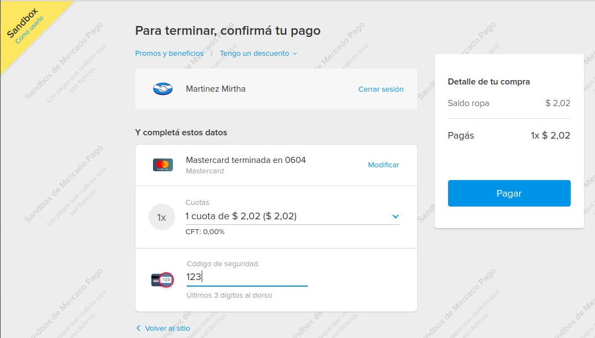

# Sistema de control de cuenta corriente
 Ellas y Nosotras es un negocio familiar dedicado a la venta de indumentaria femenina.
 En este sistema nos proponemos llevar un control de los montos de venta a cobrar a los clientes; pudiendo de esta manera tener un control de clientes morosos. 
 Los clientes podrán realizar el pago de su cuenta corriente a través de mercado pago. Para ello deberán registrarse en la página ................, una vez regsitrados van a poder consultar el estado de su cuenta, y con solo un click en el botón PAGAR podrán abonar el total del mismo.
 
 
 ## Para ello necesitamos:
 * Registrar una venta  en cuenta corriente, llevando un registro con fecha de la operación,monto entregado a cuenta de la venta, y monto adeudado, asociada a un cliente. Para ello tendremos que poder dar de alta, modificar una cuenta corriente; ademas de dar de alta, modificar, buscar por número  de cliente o apellido,y listar todos los cliente con sus respectivas deudas.
  
   
Ejemplo de como funcionaria el sistema
Damos de alta un:
 
 ### cliente:
 * n°cliente: 28808005
 * apellido: RIQUELME
 * nombre: JUAN
 * direccion: ALEM 1040
 * emai:lucasR@gmail.com
 * telefono: 2478-443605

 Registramos la venta en cuenta corriente:
 * fechaDePago: 12/04/2020
 * totalDeVenta: 980
 * montoCobrado: 500
 * montoACobrar: 380
 * apellido: RIQUELME
 * nombre: JUAN

 
 Por otro lado el cliente desee saldar su cuenta a través de la página de nuestro local, podrá hacerlo ingresando a la página ...................  en donde deberá de darde de alta como usuario ingresando los siguientes datos:
 
   ### usuario 
 * email: usuario@gmail.com
 * password: *******

 una vez que el sistema lo autentica el usuario podrá acceder al estado de su cuenta corriente en la que verá el estado de la misma; y donde podrá acceder a traveś de un link a Mercado Pago y realizar dicho pago. 

 

 Documentación de passport
[ middleware de autenticación para Node.js ](http://www.passportjs.org/)

Para que los clientes puedan hacer el pago de su correpondiente cuenta corriente, se llevó a cabo la integracion de la aplicación con el sistema de cobros online de mercado paga llamado ckeckout.

Checkout de Mercado Pago es la integración que nos permite pagar a través de un formulario web provisto por mercado pago, desde cualquier dispositivo de manera simple, rápida y segura.

Se puede pagar con los principales medios de pago del país.
No es necesario crear una cuenta de Mercado Pago para poder realizar el pago.

Para llevar a cabo la integracion debemos crear:

Preferencia (preference):
Se puede configurar con diferente información del item a pagar y del comprador, también podemos definir medios de pago que no aceptados, URL de retorno a tu sitio después de efectuado el pago, métodos de envío y demas.
Aqui se muestra la definición  de la preferencia con el item a pagar:

let preference = {
      items: [
        {
          title: "Saldo ropa",
          quantity: 1,
          currency_id: "ARS",
          unit_price: totalCuentaCorriente
        }
      ]
}
una vez definida nuestra preference la creamos:
  
  mercadopago.preferences.create(preference).then(callback);

Al crear la preferencia lo que se obtiene es el Punto de inicio (init_point) que es la URL que da inicio al flujo de pago del Checkout de Mercado Pago
Dicha URL nos redirecciona al formulario de MP para que se lleve a cabo dicho pago. Este init_point contiene toda la información con la que creamos nuestra preference.

Una vez que se efectua el pago, Mercado pago, según como haya resultado dicho pago, ya sea aprobado, rechazado o pendiente, puede redigir a quien está realizando el pago a una back_url que hayamos predefinido en nuestra preference. Esta configuracion no es obligatoria.
......
back_url: "http://localhost/3000/home"
.......

Credenciales (credentials)
Public key. Clave pública de la aplicación para conocer, por ejemplo, los medios de pago y cifrar datos de tarjeta. Debes usarla solo para tus integraciones.
Access token. Clave privada de la aplicación para generar pagos. Debes usarla solo para tus integraciones.

Para instalar el SDK de mercado pago para nodejs,para simplificar la interacción con la APIs de Mercado Pago.

$ npm install mercadopago

Cómo me integro?
1.Genera tu preferencia

1.1 Suma la SDK descargada de Mercado Pago en tu proyecto.

const mercadopago = require ('mercadopago');

1.2 Agrega las credenciales para habilitar el uso de la SDK de Mercado Pago.
// Agrega credenciales
mercadopago.configure({
  access_token: 'PROD_ACCESS_TOKEN'
});
1.3 Configura la preferencia según tu producto o servicio.
// Crea un objeto de preferencia
let preference = {
  items: [
    {
      title: 'Mi producto',
      unit_price: 100,
      quantity: 1,
    }
  ]
};

2 Suma el checkout a tu sitio
mercadopago.preferences.create(preference).then(function(response));

  

    <a href={mostrarBotonDePago} target="_blank">
      Realizar pago
    </a>
  

mostrarBotonDePago= tiene la siguiente forma
https://www.mercadopago.com.ar/checkout/v1/redirect?pref_id=569345333-196ca275-3f93-4f07-8e0d-48df7fbfaf08

Obtén tu Access token
Las credenciales son las claves únicas con las que identificamos una integración en tu cuenta. Sirven para capturar cobros en tiendas online y otras aplicaciones.

Para configurar el SDK debes usar el método cofigure.Este método recibe un objeto JSON. Las configuraciones válidas son:

client_id - String
client_secret - String
access_token - String
sandbox (default: false) - Boolean
show_promise_error (default: true) - Boolean

Modo Sandbox
Si vas a utilizar nuestra aplicación en modo Sandbox, debes proporcionar el access_token.

Ten en cuenta que si proporcionas el client_id y client_secret, la SDK generará un access_token productivo.

mercadopago.configure({
  sandbox: true,
  access_token: "ACCESS_TOKEN"
});

Para poder comenzar a recibir pagos, es necesario que la aplicación esté en etapa de producción. Una vez que nos encontramos ahi debemos llenar una solicitud para obtener las credenciales de producción.

 
